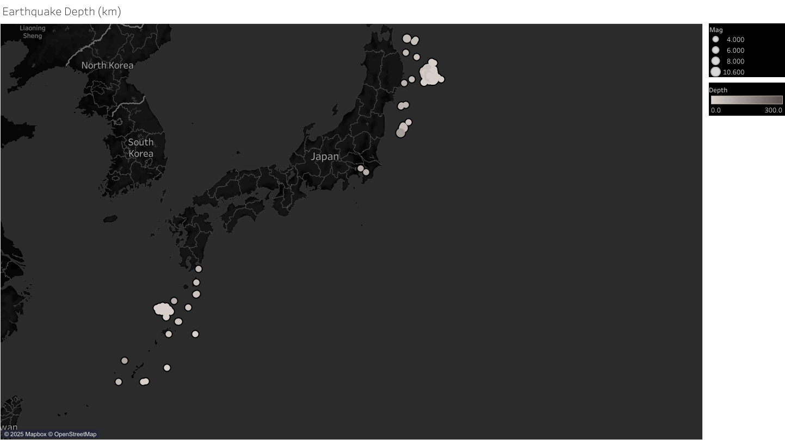
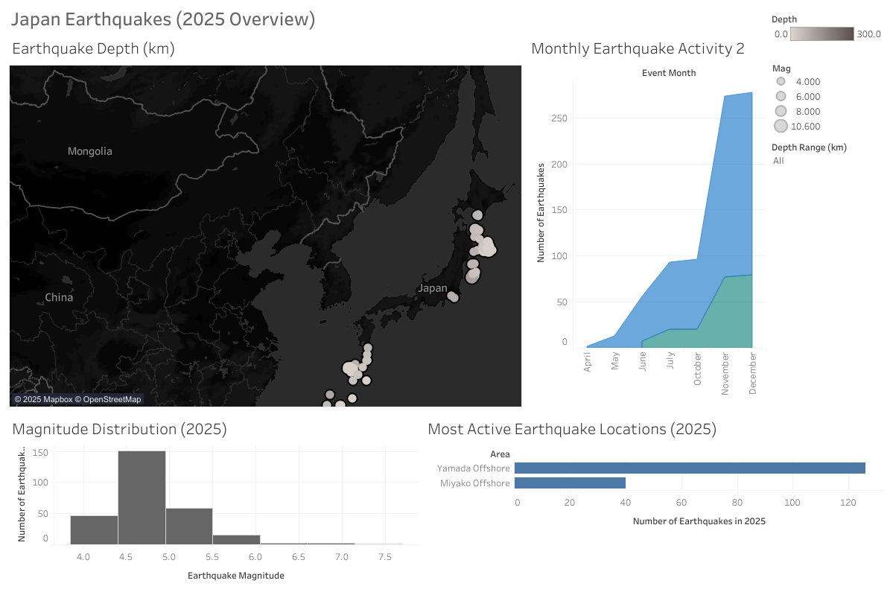

# Japan Earthquakes 2025
Data visualisation and poster project exploring earthquake patterns in Japan (2025), created using **Tableau** and **Figma**.

## Project Overview
Japan sitting along the Pacific Ring of Fire that makes it one of the most active regions on Earth.
This project explores **location** and **impact** of the earthquakes in Japan were in 2025 through data visualisation and poster.

The workflow combines:
- **Data exploration & analysis** in Tableau
- **Visual storytelling & layout design** in Figma

## Data Source 
- **Source:** [Kaggle/stpeteishii](https://www.kaggle.com/datasets/stpeteishii/earthquake-in-japan)
- **Link:** [Tableau](https://public.tableau.com/app/profile/chng.sheng.yao/viz/japanearthquakedashboard/JapanEarthquakeDashboard2025)
- **Scope:**  Recorded earthquake events in Japan (2025)
- **Key attributes:** time, location, depth (km), magnitude, region.

Raw datasets are available in the [`/data`](./data) folder.

## Analysis
### 1. Earthquake Clusters

Breakdown of the earthquake cluster:
- Major earthquake clusters appearing offshore along Japan's north-eastern region, where the Pacific Plate subducts beneath the Okhotsk Plate.
- Western side of Japan (Sea of Japan side) showing fewer earthquake evetns compared to the Pacific-facing side
- Earthquakes occuring near the Japanese coastline fall within shallow to intermediate depths (0-70km).

### 2. Magnitude Distribution 

Most of earthquakes fall within the **moderate range of 4.0-5.0** while high-magnitude events are comparatively rare. 
Here is the breakdown of the magnitude distribution:
- The concentration of earthquakes in moderate range indicates frequent seismic activity without a high occurrence of extreme events.
- Earthquakes exceeding magnitude 6.0 are uncommon; depsite the seismic activity is persistent, large, destructive earthquakes did not dominate during the observed period.
- The histogram is showing a right-skewed distribution, where lower-to-moderate magnitude earthquakes occurs more frequents and consistent with typical tectonic release patterns along subduction zones.

### 3. Earthquake Monthly Count

The chart is showing the montly distribution of recorded earthquakes in Japan during 2025.

**Key Insights:**
- Earthquake activity rises sharply toward the later months of the year with more events occuring during this period, with November and December showing the highest counts
- Monthly earthquake counts dominated by moderate-magnitude events which makes up the majority of total observation in each month.

### 4. Top Area Hotspot 

The earthquake activity is highly concentrated in offshore regions with one area showing a significant higher number of events than others. 

Here is the breakdown:
- **Yamada Offshore** is the most active earthquake hotspot, recording far more events in the dataset.
- **Miyako Offshore** showing moderate activity at a lower level, highlighting an uneven spatial distribution of seismic events across offshore zones.

## Conclusion

The earthquake data for 2025 shows that the seismic activity in Japan is frequent but mostly moderate, with events concentrated offshore along the active plate boundaries rather than evenly spread across the region.

## Dashboard

